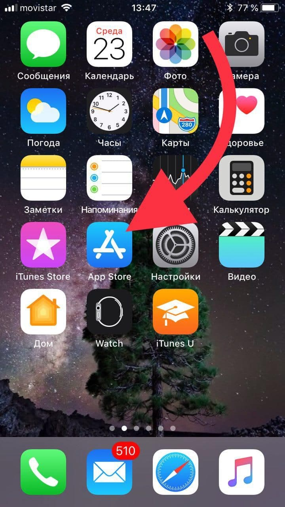
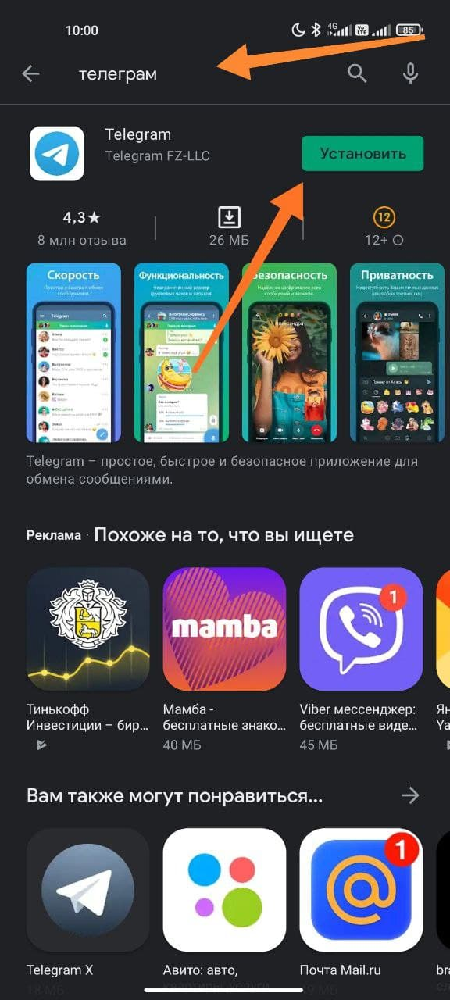
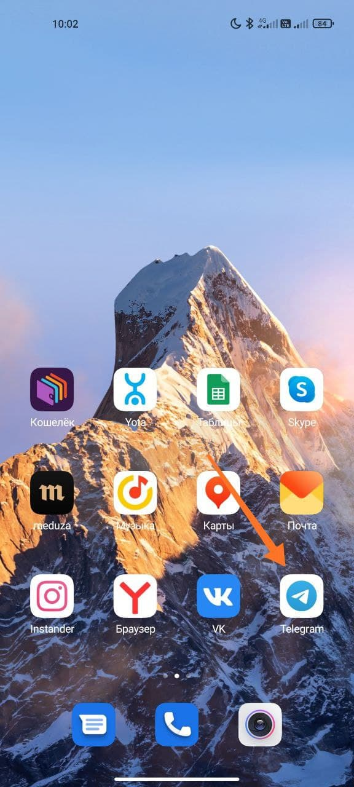
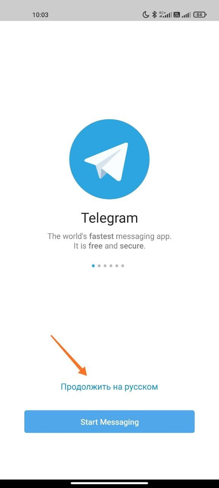
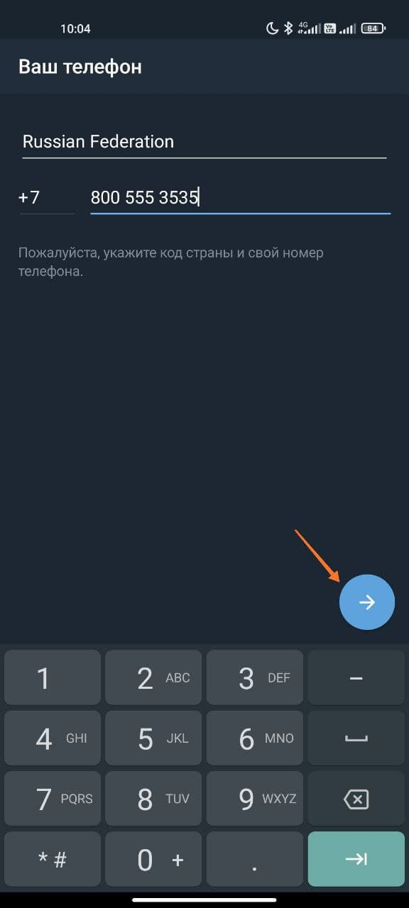
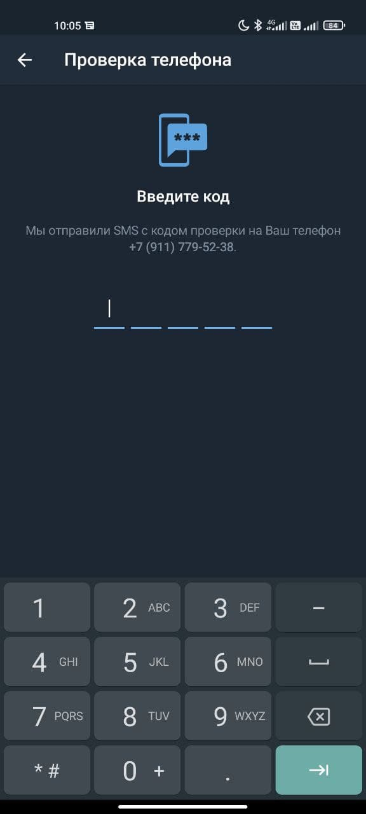
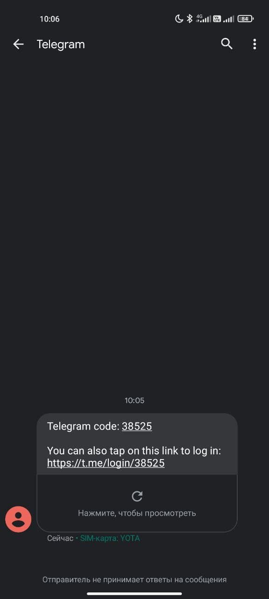
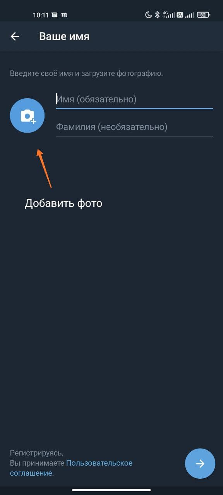

# Установка Telegram на мобильные устройства

Уважаемые заведующие, в нашей сети был создан новый чат для заведующих аптек, посредством мессенджера Telegram. Ниже приведена инструкция по его установке и последующей регистрации.

**Установка на мобильные устройства \(Android / iOS\)**

Найдите на своём устройстве магазин приложений Play Market / AppStore соответственно:

В магазине приложений найдите посредством поиска приложение Telegram:

 

В дальнейшем изображения по инструкции будут только с платформы Android, на iOS все элементы находятся в аналогичных местах.

Найдите на телефоне установленное приложение. Оно появится у вас на начальном экране, отныне вход в него будет осуществляться отсюда \(на редких устройствах приложения попадают в т.н. Меню, а не на начальный экран\).

Процесс регистрации вы проходите единожды, после чего этих действий не потребуется. Зайдите в приложение, после чего нажмите на кнопку “Продолжить на русском”. В окне ввода номера введите свой номер и нажмите на стрелочку:

После ввода номера, вам необходимо подтвердить его. Вам в сообщения телефона должен прийти код, который необходимо ввести в окно «Проверка телефона»:

После ввода кода, заполните информацию о себе. Вы так же можете добавить свою фотографию

