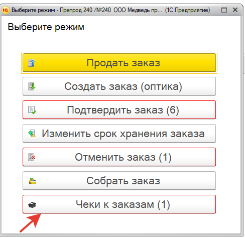

# Доставка

В меню работы с заказами добавлена кнопка «Чеки к заказам».

Сюда попадают заказы, по которым нужно допробить закрывающие чеки – это заказы по доставки и заказы УФСИН после онлайн оплаты.

До обновления заказы по доставке закрывались автоматически при закрытии смены без пробития чеков. При этом, оплата по банку по этим чекам не отображалась в z-отчете. Этот механизм сохраняется, но теперь вы можете сами пробить закрывающие чеки, чтобы видеть их в z-отчете.

