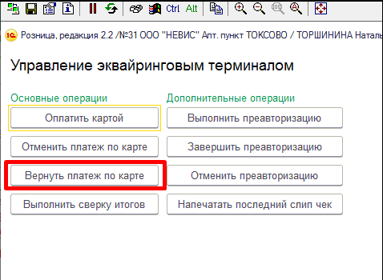

# 6. Возможные проблемы с кассой и решения

**Возможные проблемы по кассе и пути их решения**

Отдел информационных технологий составил список наиболее распространенных проблем с кассой и ошибок кассиров. Для того чтобы вы могли правильно отреагировать в той или иной ситуации, предлагаем вам описание и пути решения этих проблем.

Убедительная просьба донести информацию, описанную в данном разделе до всех сотрудников аптеки, работающих за кассой.

1\) Не забывайте вовремя менять кассовую ленту. Если на кассовой ленте появилась красная (или синяя) полоса, то меняем ленту

2\) Не забывайте закрывать смену. Касса перестает работать через 24 часа после открытия смены.

Круглосуточные аптеки закрывают смену **до** 00:00.

Делают внесение **после** 00:00.

3\) Касса перестает работать, если не передает чеки в налоговую 30 дней. Проверяйте в X или Z отчетах, строки «Непереданных ФД», «ФД не переданы с», «Первый непереданный ФД» должны быть «0». Если в этих строках другие цифры, свяжитесь с компьютерным отделом!

 (1)>)  (1)>)

4\) После закрытия аптеки, **главную кассу** (на которой находится база 1с) **выключать не надо** (т.к. могут проходить регламентные задания\обновления). **Второстепенные кассы и компьютер заведующей выключаем** (пуск – завершение работы-ок) предварительно закрыв программу 1С. Если в вашей аптеке находится сервер, то его не выключаем, а остальные компьютеры выключаем.

5\) Запускайте 1С на кассе только под своим пользователем (ФИО кассира).

ВНИМАНИЕ! Если нужно ввести нового пользователя (кассира) сообщите об этом в отдел ИТ за 2 дня (для создания требуется определенное время, позаботьтесь об этом заранее)

6\) При отключении света в аптеке, обязательно нужно выключать по очереди компьютеры (они будут работать от ИБП 5-10 минут) – главную кассу в последнюю очередь. Если ИБП не держит заряд и компьютеры сразу отключились, то оставьте заявку в отдел ИТ.

7\) Если при запуске программы 1С:

\- появляется сообщение «нет свободной лицензии», то закрываем программу 1С на всех компьютерах и делаем перезагрузку «главной» кассы (сервера) (пуск – перезагрузка-ок).

\- долго зависает окно (см. ниже), то нужно подождать (программа не зависла)

>)

\- Если при запуске программы появляется сообщение (см. ниже), то закройте ошибку и запустите файл на раб. столе «Чистка 1С.bat»

Если у вас нет этого файла, то скачайте через FileZilla на флешку (можно взять из фоторамки) и скопируйте на гл. кассу.

>)

Или

 (1)>)

8\) Если нужно сделать перезагрузку кассового компьютера, то обязательно нужно закрыть программу 1С. Если нужно перезагрузить главный компьютер, то нужно закрыть 1С на всех компьютерах.

На кассе закрыть программу можно нажав мышкой по фамилии фармацевта (см. ниже)

>)

**Старайтесь не допускать перезагрузку компьютера при открытой программе 1С!**

9\) При оплате по банку могут быть следующие ситуации: выходит 2 банковских чека; выходит 1 банковский чек; не выходит ни одного банк. чека; выходят банк. чеки с отменой операции. Программа не дает получить 3й кассовый чек. Может появится окно с ошибкой 2000.

В этой ситуации необходимо:

А)

\- Закрыть окна с оплатой, чтобы на экране остался набранный чек.

\- Отложить текущий чек, для этого нажать Alt+F5.

\- Нажать F10/Выход до главного меню программы

\- Выбираем Эквайринг- Выполнить сверку итогов

 (1)>)

Б) Снимаем отчет без гашения

В)

\- Если в сверке по банку нет чека:

Заходим в Регистрацию продаж

Нажимаем Ctrl+F5

Выбираем отложенный чек

Пробиваем чек по безналу

\- Если в сверке по банку есть чек и в отчете без гашения его нет, то надо отложенный чек закрыть без авторизации (позвоните в комп. отд.).

\- Если в сверке по банку есть чек и в отчете без гашения он прошел, то нужно отложенный чек аннулировать. Проверить в товарных чеках данный чек, если его нет позвоните в комп. отд.

\- Если, с клиента списалась оплата дважды (в чеке сверки мы видим две одинаковых оплаты), «Лишнюю» оплату по терминалу клиенту необходимо вернуть сразу же после оплаты чека.

Открываем меню «Эквайринг»

 (1)>)

Затем выбираем «Вернуть платеж по карте»

Снимаем галочку «Указать дополнительные данные» и вводим сумму для возврата

\
 (1)>)

Нажимаем «Выполнить операцию», открывается окно банковского терминала, клиент прикладывает/вставляет карту, при запросе вводит пин-код. Далее необходимо ввести номер ссылки (**указана на банковском чеке снизу**) и нажать «ОК»

 (1)>)

Деньги вернуться клиенту в самое ближайшее время (обычно сразу). При этом операция возвращает только деньги на карту, чек остается проведенным, товар – списанным.

10\) Подтверждение оплаты товара по SMS/

Документом, позволяющим отдать товар при расчете по карте, является банковский чек. SMS-сообщение, пришедшее на телефон клиента, ни в коей мере не может считаться таким документом.

Если возникла спорная ситуация, то необходимо сделать закрытие смены по терминалу и проверить в нем оплату (эквайринг - Выполнить сверку итогов).
