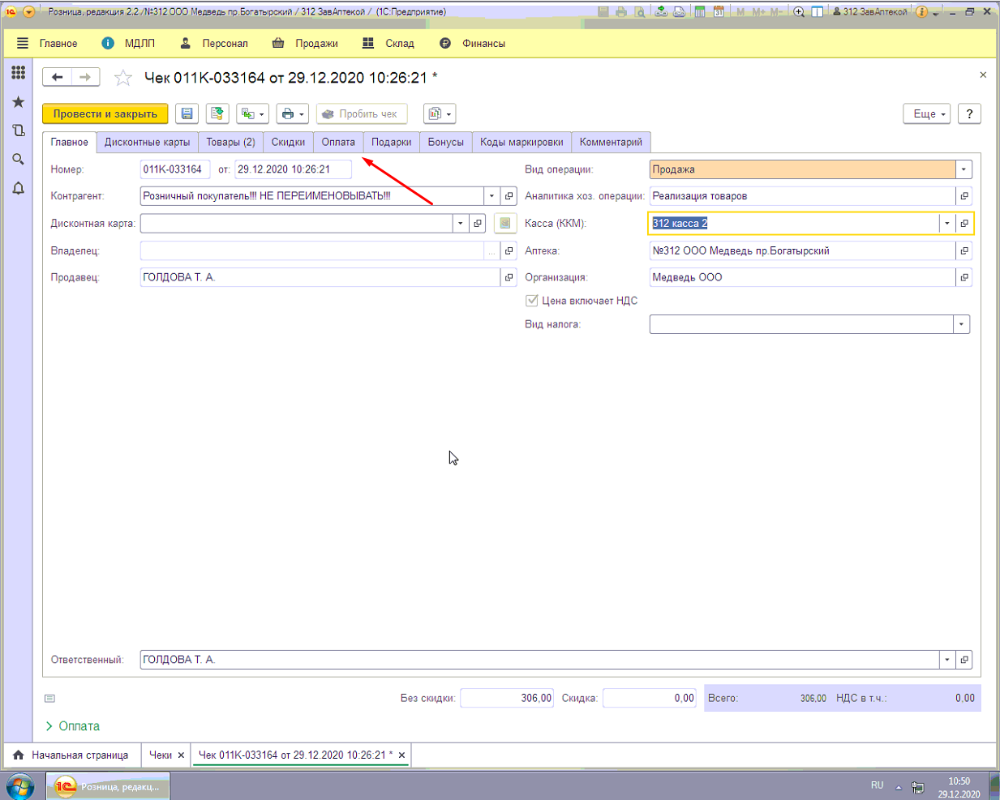
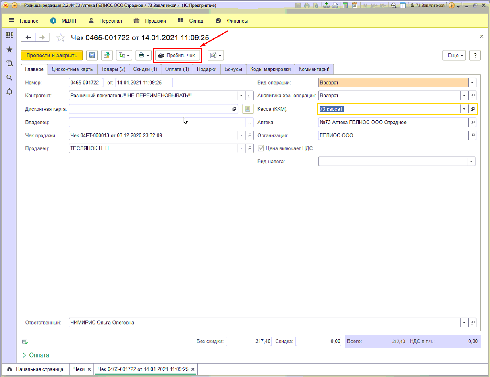

# Инструкция по продаже и возврату без авторизации

**1. Пробитие чека без авторизации**

Если Вам нужно пробить чек без авторизации, и Вы не знаете, какие товары входят в этот чек, попробуйте посмотреть в списке не проведённых чеков(аннулированных) за этот день (в 1с зайдите продажи-Чек ККМ) или подберите товар по сумме (сумма должна сходиться), по необходимости можете сделать переоценку или скидку, чтобы суммы совпали.

Если Вы знаете, что товар в чеке маркированный, Вам необходимо распечатать КИЗ, используйте обработку (Финансы – дополнительные обработки-печать DataMatrix)

1. Набираем товары в чек (если нужно делаем скидку).

>)

Сверяем сумму чека должна совпадать.

1. Откладываем чек клавишами (Alt+F5) или через Меню(F12) внизу нажимаем кнопку (Отложить текущ. чек(Alt+F5)).
2. Закрываем 1С.
3. Открываем 1С под пользователем «Заведующая» (на этой же кассе, на которой отложили чек).
4. Заходим во вкладку ПРОДАЖИ-ЧЕК ККМ и находим наш отложенный чек. (Статус у этого чека Отложенный).

>)

1. Открываем наш чек заходим во вкладку оплата.

1. Нажимаем Добавить-Платежная карта.

1. Сверяем сумму и нажимаем кнопку провести (смотрите рисунок) после проведения документа станет активна кнопка (Пробить чек).

>)

1. После того как провели документ нажимаем кнопку (Пробить чек).

>)

Распечатается чек, пробитый по карте (без авторизации). Пишем служебную записку бухгалтеру о проделанной работе. За этот день у вас сумма в Z отчете будет больше на сумму этого чека, чем в отчете по банку.

**2. Пробитие возвратных чеков без авторизации.**

ВНИМАНИЕ! Если товар маркированный, то делать возврат без авторизации по данной инструкции НЕЛЬЗЯ.

Если Вам нужно сделать возврат без авторизации, и Вы не знаете, какой был чек, попробуйте посмотреть в списке чеков за этот день (в 1с зайдите продажи-чек ккм) или в поиск введите сумму чека (**на примере мы будем рассматривать чек на сумму 217,4**).

1. Набираем в поиск сумму чека (если нужно). Видим два чека на одинаковую сумму с одинаковыми позициями.

(запоминаем № чека ККМ и дату, какой будем возвращать)

>)

1. На кассе Нажимаем Возврат(F5).

>)

1. Вбиваем дату и номер чека и нажимаем кнопку ENTER, появится возвращаемый чек. Нажимаем кнопку в виде треугольника (смотрите картинку).

1. Выбираем надпись Возврат и нажимаем опять кнопку в виде треугольника (смотрите картинку). У Вас сформируется возвратный чек.

>)

1. Откладываем чек клавишами (Alt+F5) или через Меню(F12) внизу нажимаем кнопку (Отложить текущ. чек(Alt+F5)).

>)

1. Закрываем 1С.
2. Открываем 1С под пользователем «Заведующая» (на этой же кассе, на которой сформировали возвратный чек).

Заходим во вкладку ПРОДАЖИ-ЧЕК ККМ и находим наш возвратный чек. (Статус у этого чека Возвратный). 

1. Открываем наш чек, сверяем сумму и нажимаем кнопку Провести. (смотрите рисунок) после проведения документа станет активна кнопка (Пробить чек). Нужно нажать на кнопку «Пробить чек».

Распечатается Возвратный чек, по карте (без авторизации). Пишем служебную записку бухгалтеру о проделанной работе.

С уважением, отдел информационных технологий.
