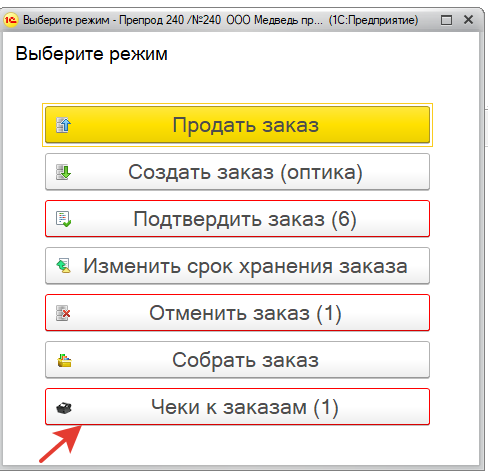
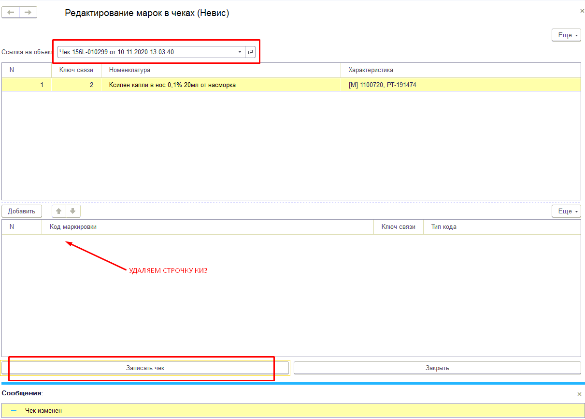
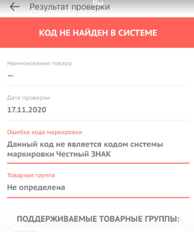

# Проблемы с маркировкой

1. Если заблокировалось изменение уведомления в статусе черновика

- в уведомление пробуем нажать «еще» \(кнопка выше наименований\) –возобновить проверку товаров

или

-в групповом изменении в документе уведомление о приемке .. поменять "Статус проверки и подбора" на "Не выполнялось"

2. Добавление товара в уведомление, если удалили

Нужно в уведомление удалить привязку к накладной и заново создать уведомление

3. Как пробить марку, которую отдали

Печатаем qr код через обработку

4. Если товар с одинаковым КИЗ списался дважды

\(данный механизм нельзя использовать для обычного возврата. Возвраты маркированных товаров запрещены\)

1. Убеждаемся, что в обоих чеках одинаковый КИЗ
2. Проверяем что оба чека ушли в СБИС
3. **Редактором чеков** открываем нужный чек \(любой из двух\), ставим галочку, нажимаем разрешить.

1. **Редактором марок в чеках** \\NEVIS-TERM\Soft\Для Губича\РОЗНИЦА\Обработки\РедактированиеМарокВЧеках открываем один из чеков, удаляем КИЗ, нажимаем записать.

1. На кассе нажимаем F5, видим один чек с маркой и один без марки \(отредактированный нами\)

1. Выбираем немаркированный чек, делаем возврат.

## 5. Не сканируется Datamatrix

Если не сканируется товар сканером, печатаем через обработку qr код.

## 6. Снять марку у товара

Сначала согласовать с поставщиком. Если поставщик подтвердил, то заходим в накладную напротив товара снимаем галочку маркировка, записать, снимаем галку «не загружать из невис» и заходим в хар-ку, нажимаем записать, проверяем чтобы у хар-ки не было марки. Возвращаем галочку «не загружать из невис» обратно.

## 7. У вас проведена накладная, обработано уведомление \(не важно какой ответ по нему\), но товар не появляется на кассе.

Попробуйте перезаписать уведомление и перезаписать накладную. В большинстве случаев это решает проблему \(в том числе и для интернета заказов\).

Если не помогло необходимо убедиться, что в уведомлении и в накладной одинаковые характеристики. Например, в уведомлении к серии добавляем еще один знак и перезаписываем характеристику, в накладной тоже должно измениться. После этого меняем характеристику на верную в уведомлении, удаляем эту позицию в упаковках МДЛП и перезаписываем уведомление.

Если не дает провести уведомления из-за дублей кизов, то можно поставить состояние «в обороте» для кизов из уведомления в регистре сведений «упаковки мдлп».

## В документе отсутствуют товары с GTIN

Если при сканировании товара выдает такое сообщение, значит была заменена карточка товара и отсканировать его не получится.

Исправляем только уведомления, которые находятся в статусе «Черновик» либо еще не было оформлено.

В **ЦБ \(в аптеке обработка не тестировалась, делаем в Центральной Базе\)** открываем обработку **ЗаменаНоменклатурыВПТУУвПЛП.epf**

nevis-term\Soft\Для Губича\РОЗНИЦА\Обработки\ЗаменаНоменклатурыВПТУУвПЛП.epf

1. Выбираем дату поступления
2. Выбираем контрагента
3. Выбираем номенклатуру, которую хотим заменить \(неправильную\)
4. Выбираем номеклатуру, на которую хотим поменять \(правильную\). Здесь необходимо определить, какой штрихкод на упаковке фактический \(программа пишет его при попытке отсканировать «В документе отсутствуют товары с GTIN 04607008133448 – этот GTIN нам и нужно найти\). Проверить это можно следующим образом:

Нажимаем как на скриншоте

Заходим в Штрихкоды

Сверяем GTIN выбранной номенклатуры со GTIN на упаковке. У товара должен быть и EAN и GTIN

Затем нажимаем «Заполнить», ищем накладную, в которой хотим поменять карточку, ставим напротив нее галочку и нажимаем «Обработать»

Если в столбце «Уведомление о приемке» пусто, значит оно еще не создавалось. Если есть уведомление – проверяем, чтобы оно было в статусе черновик. Пока обработка не может править регистр «Упаковки МДЛП».

Одну накладную обработка исправляет около 20-30 секунд. Она изменяет карточку в накладной и в уведомлении \(если оно было создано\). После этого делаем обмен с аптекой, и сканируем товар.

## Не сканируется ИБУКЛИН

Узнаем у аптеки дату производства. Если 01.2020, то заходим в накладную под администратором и снимаем галочку признака МДЛП, проводим накладную, продаем товар как немаркированный. Лучше всего попросить у аптеки фото и проверить марку приложением «Честный знак», оно должно написать ошибку «Код не найден в системе»

## 9. Не сканируется ВОБЭНЗИМ

Печатаем qr код через обработку

